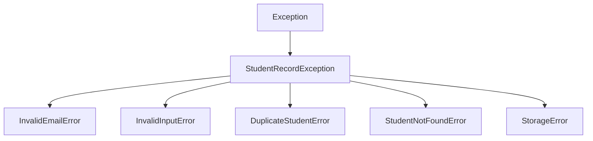

# 🎓 Student Record Manager

[](https://www.python.org/downloads/)
[](https://opensource.org/licenses/MIT)
[]()
[]()

A modular, object-oriented Python application designed to manage student academic records with robust regular-expression validation, persistent file storage, custom exception handling, and a clean interactive terminal interface.

---

## 🌟 Key Features

| Feature | Description | Implementation |
| :--- | :--- | :--- |
| **Add Student** | Enroll student with ID, Name, Email, Course, and GPA. | `src/models.py`, `src/manager.py` |
| **Validate Email using Regex** | Strict format validation enforcing standard email structure (`user@domain.tld`). | `src/validator.py` (`re` module) |
| **Save Data to File** | Persistent JSON storage with atomic writes to prevent corruption. | `src/storage.py` |
| **Read Student Data** | Load and display records in an aligned ASCII table; includes multi-field search. | `src/storage.py`, `src/cli.py` |
| **Handle Invalid Input** | Custom exception hierarchy preventing crashes on malformed data or duplicate IDs. | `src/exceptions.py` |

---

## 📁 Project Structure

```
student-record-manager/
├── src/
│   ├── __init__.py          # Package initialization
│   ├── exceptions.py        # Custom exception hierarchy
│   ├── validator.py         # Regex email and input validation logic
│   ├── models.py            # Student data model & serialization
│   ├── storage.py           # File persistence (JSON read/save)
│   ├── manager.py           # Business logic & CRUD operations
│   └── cli.py               # Interactive CLI with try/except loops
├── tests/
│   ├── __init__.py          # Test suite package
│   ├── test_validator.py    # Unit tests for regex and validators
│   └── test_manager.py      # Unit tests for CRUD, I/O, & exceptions
├── data/
│   └── students.json        # Persistent JSON data storage
├── main.py                  # Application entry point
├── .gitignore               # Standard Python gitignore
├── LICENSE                  # MIT License
└── README.md                # Project documentation & GitHub guide
```

---

## 🚀 Quick Start

### 1. Prerequisites
- **Python 3.8+** (Zero external dependencies — uses Python standard library!)
- **Git**

### 2. Run the Application
Clone the repository and run `main.py`:

```bash
# Navigate to the project directory
cd student-record-manager

# Launch the interactive CLI
python main.py
```

---

## 🖥️ Interactive CLI Walkthrough

When you start `main.py`, you are presented with the interactive menu:

```
============================================================
              STUDENT RECORD MANAGER (v1.0)
============================================================
 Features: Add Student | Regex Email Validation | File I/O
           Custom Exception Handling | GitHub Ready
============================================================

--- MAIN MENU ---
1. Add New Student
2. View All Students
3. Search Students
4. Delete Student
5. Save Records to File
6. Reload Records from File
7. Exit
------------------------------
Select an option (1-7):
```

### Example: Viewing All Students
```
========================================================================================
| ID     | Name          | Email                        | Course           |      GPA |
========================================================================================
| STU101 | Alice Johnson | alice.johnson@university.edu | Computer Science |     3.85 |
| STU102 | Bob Smith     | bob.smith@techcollege.org    | Data Science     |     3.65 |
| STU103 | Clara Davis   | clara.davis@institute.ac.uk  | Cybersecurity    |     3.92 |
----------------------------------------------------------------------------------------
 Total records: 3
========================================================================================
```

---

## 🔍 Validation & Exception Handling

### 1. Regex Email Validation
The application validates email addresses using the standard RFC-compliant regular expression:
```python
EMAIL_REGEX_PATTERN = r"^[a-zA-Z0-9_.+-]+@[a-zA-Z0-9-]+\.[a-zA-Z0-9-.]+$"
```
- **Valid:** `student@university.edu`, `john.doe+tag@domain.co.uk`
- **Invalid:** `invalid.email`, `user@`, `@domain.com`, `user name@domain.com`

If an invalid email is provided, an `InvalidEmailError` is raised with a descriptive message:
```
[ERROR] Invalid email format: 'alex.invalid'. Expected format: name@domain.com
```

### 2. Custom Exception Hierarchy


All user interactions in the CLI are enclosed in `try...except` blocks, allowing the user to re-enter corrected values without terminating the program.

---

## 🧪 Running Unit Tests

Run the complete automated test suite using Python's built-in `unittest` runner:

```bash
python -m unittest discover -s tests -v
```

Output:
```
test_add_duplicate_student_raises_exception ... ok
test_add_student_success ... ok
test_delete_student_success ... ok
test_save_and_read_persistence_roundtrip ... ok
test_search_students ... ok
test_valid_emails ... ok
test_invalid_email_missing_at ... ok
test_invalid_email_with_spaces ... ok
...
Ran 19 tests in 0.045s
OK
```

---

## 📦 How to Publish to GitHub

Follow these steps to publish this repository to your personal or organization GitHub account:

### Step 1: Create a New GitHub Repository
1. Go to [github.com/new](https://github.com/new).
2. Set **Repository name** to `student-record-manager`.
3. Choose **Public** or **Private**.
4. Leave **"Initialize this repository with..."** unchecked (we already have README, .gitignore, and license).
5. Click **Create repository**.

### Step 2: Initialize & Push from Your Terminal
Run the following commands inside the `student-record-manager` directory:

```bash
# 1. Initialize local git repository (if not already initialized)
git init

# 2. Stage all project files
git add .

# 3. Create your initial commit
git commit -m "feat: initial commit - Student Record Manager with regex email validation and persistence"

# 4. Set default branch to main
git branch -M main

# 5. Link to your GitHub repository (replace YOUR-USERNAME with your GitHub handle)
git remote add origin https://github.com/YOUR-USERNAME/student-record-manager.git

# 6. Push code to GitHub
git push -u origin main
```

---

## 📄 License

This project is licensed under the MIT License - see the [LICENSE](LICENSE) file for details.
